  

 

  

 

  
  &nbsp;&nbsp;
  
  &nbsp;&nbsp;
  

  

  
    
  Currently building <a href="https://halaali.app"><strong>Halaali</strong></a> — the Muslim Super App

  

  <em>"that man will only have what he has worked towards"</em> — 53:39

